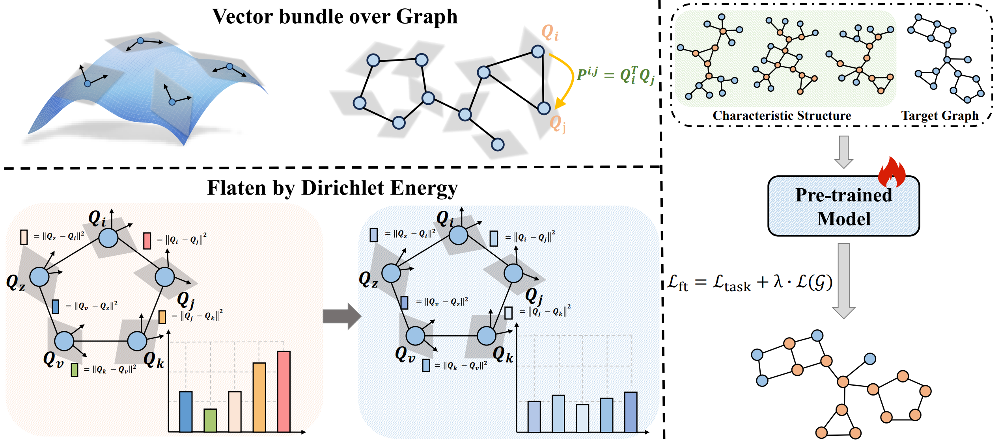
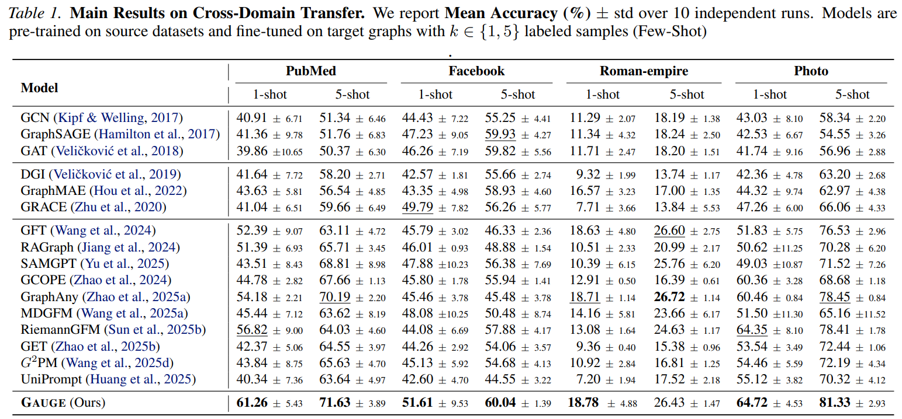
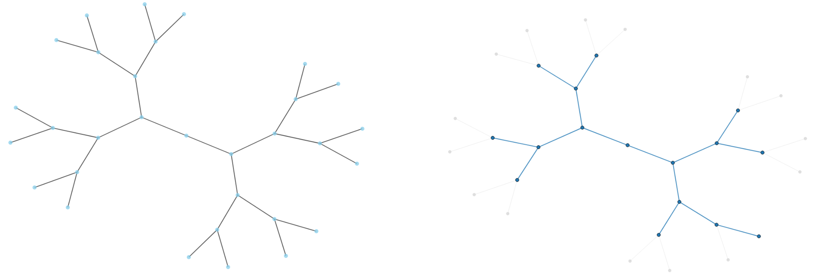
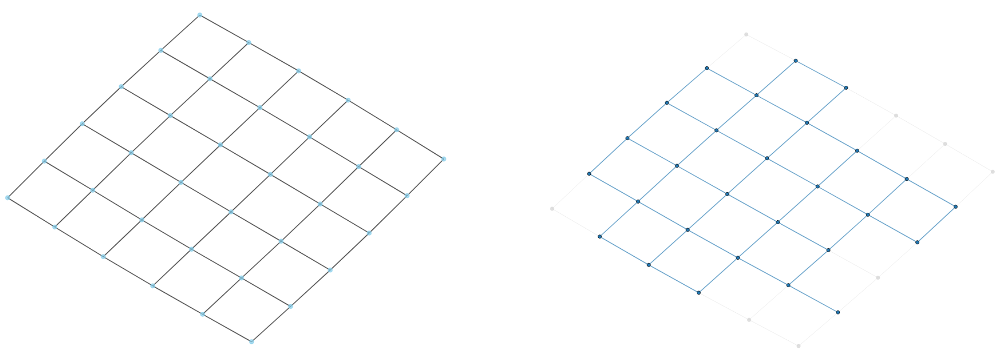
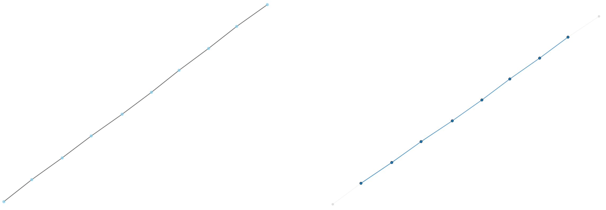
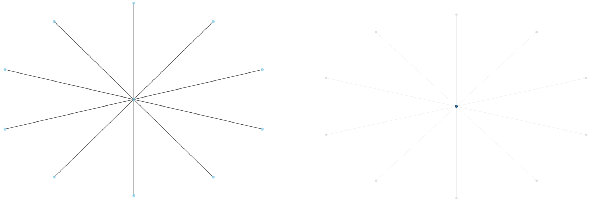

# GAUGE: Are Common Substructures Transferable? Riemannian Graph Foundation Model with Neural Vector Bundles [ICML 2026]

## Get Started

To run the pretraining, please using the following command:
```shell
python main.py --run_type pretrain \
 --pretrain_graph_data ${GRAPH_DATASETS_LIST}
```
You need to replace ```${SGRAPH_DATASETS_LIST}``` 
with lists of graph dataset names. 
For instance, ```[ogbn-arxiv, Reddit, Questions, Computers, Amazon-ratings]```.

To run the adaptation for few-shot transferring, please using the following command:
```shell
python main.py --run_type adapt \
 --pretrain_graph_data ${GRAPH_DATASETS_LIST} \
 --pretrained_checkpoint checkpoints/pretrain/${GRAPH_DATASETS_LIST}/${MODEL_NAME}.pth \
 --data_name ${DATA_NAME} \
 --task_type ${TASK_TYPE} \
 --metric ${METRIC}$ \
 --k_shot $K_SHOT$
```
You need to replace ```${MODEL_NAME}``` 
with the file name of checkpoint that needed to use;
```${DATA_NAME}``` with the dataset name for transfer, e.g., ```Photo```;
```${TASK_TYPE}``` with ```node_cls, graph_cls, link_cls```;
```${METRIC}$``` in [```acc```, ```auc```, ```ap```,```mse```,```mae```];
```$K_SHOT$``` with ```1, 5``` or other number you want to transfer.

## GAUGE FrameWork
<div align=center>

</div>
<div align=center>
Figure 1. An Illustration of GAUGE Framework.
</div>

## Experimental results
<div align=center>

</div>
<div align=center>
Figure 2. Main Results on Cross-Domain Transfer. 
</div>

## Visualization
<div style="display: flex; justify-content: space-between; align-items: center;">
  
</div>
<br>
<div style="display: flex; justify-content: space-between; align-items: center;">
  
</div>
<br>
<div style="display: flex; justify-content: space-between; align-items: center;">
  
</div>
<br>
<div style="display: flex; justify-content: space-between; align-items: center;">
  
</div>
<div align=center>
Figure 3. Visualization on tree, grid, path and star graphs.
</div>

## Citation
```
@inproceedings{
sun2026are,
title={Are Common Substructures Transferable? Riemannian Graph Foundation Model with Neural Vector Bundles},
author={Li Sun, Zhenhao Huang, Yiding Wang, Qin Chen, Pietro Li\`o, Philip S. Yu},
booktitle={Forty-third International Conference on Machine Learning},
year={2026}
}
```